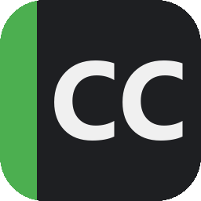

<div align="center">



# Corte Cenas

**Analisador de episódios de anime pra Windows.**
Corta o episódio em shots, identifica os personagens em cada um e organiza tudo
em pastas por personagem e por dupla — automático, sem alimentar pasta de foto nenhuma.

[](https://github.com/leviclementino1-creator/corte-cenas/releases/latest)
[](https://github.com/leviclementino1-creator/corte-cenas/releases)


-76B900)

**[⬇️ Baixar a versão mais recente](https://github.com/leviclementino1-creator/corte-cenas/releases/latest)**

[Instalar](#-instalar) •
[Como usar](#-como-usar) •
[Deu problema?](#-deu-problema) •
[Como funciona](#%EF%B8%8F-como-funciona-por-dentro) •
[Pra desenvolvedores](#%EF%B8%8F-rodar-do-código-fonte)

</div>

---

## ✨ O que ele faz

Você arrasta um episódio pra janela. O app:

1. 🎬 **Detecta e corta** cada shot (mudança de cena) em um `.mp4` separado
2. 🔍 **Busca os personagens** do anime automaticamente (AniList + MyAnimeList) — incluindo temporadas anteriores da franquia
3. 🧠 **Reconhece quem aparece** em cada shot (YOLO detecta os rostos, CLIP compara com as fotos de referência — ou, se preferir, uma IA generativa classifica)
4. 📁 **Organiza tudo** em `by_character/<Nome>/` e `by_pair/<A>+<B>/` usando hardlinks (sem duplicar espaço em disco)
5. 📱 Ainda gera **versão vertical 1080×1920** de qualquer personagem pra Reels/TikTok, com enquadramento no rosto

```
Output/Dr Stone/S04E25/
├── shots/               0001.mp4, 0002.mp4, ...        (todos os cortes)
├── by_character/
│   ├── Senku/           só os shots em que o Senku aparece
│   └── Kohaku/
├── by_pair/
│   └── Senku+Kohaku/    shots em que os dois aparecem juntos
└── metadata/            shots.json, characters.json
```

---

## 📥 Instalar

**1 arquivo, 3 cliques, ~1 minuto:**

1. Baixe o **[CorteCenas-Setup mais recente](https://github.com/leviclementino1-creator/corte-cenas/releases/latest)** (~2 GB — procure o `CorteCenas-Setup-X.Y.Z.exe`)
2. Dois cliques no arquivo baixado
3. **Avançar → Avançar → Instalar → Concluir**

Pronto: atalho na área de trabalho e no menu iniciar. O **FFmpeg já vem embutido** — nada de baixar de outro site ou mexer em PATH.

> ⚠️ Se o Windows 11 reclamar (Smart App Control / SmartScreen), é porque o instalador não tem assinatura digital paga — clique em "Mais informações → Executar assim mesmo".

### Requisitos

| Item | Recomendado | Mínimo |
|---|---|---|
| Sistema | Windows 10/11 x64 | Windows 10 x64 |
| GPU | NVIDIA RTX 20xx+ (driver CUDA 12.8+) | Qualquer (roda em CPU, ~20x mais lento) |
| RAM | 16 GB | 8 GB |
| Disco | 8 GB livres | 5 GB |
| Internet | Primeira análise baixa os modelos (~900 MB) e as fotos dos personagens de cada anime | idem |

O badge no topo da janela mostra em que modo você está: 🟢 GPU ou 🟡 CPU.

### 🔄 Atualizações são automáticas

Toda vez que o app abre, ele confere se saiu versão nova. Se sim, pergunta se quer atualizar — aceita, autoriza no UAC, e em ~30 segundos reabre atualizado. **O update baixa só ~53 MB**, não os 2 GB do instalador. Suas configurações e clipes ficam intactos.

---

## 🎬 Como usar

### 1. Carregar o episódio

**Arraste o arquivo do episódio** (`.mp4`, `.mkv`...) pra qualquer lugar da janela — o app preenche anime, temporada e episódio a partir do nome do arquivo. Ou use o botão **Selecionar**.

Confira os campos (pra temporadas específicas tipo "Dr. Stone S4", preencher certo importa) e, se quiser, informe os tempos de **OP/ED** pra pular abertura e encerramento.

### 2. Escolher o modo e analisar

| Botão | O que faz | Custo |
|---|---|---|
| **Analisar episódio** 🟢 | Pipeline local: YOLO + CLIP comparam com fotos de referência | Grátis, ilimitado |
| **Analisar com IA** 🔵 | Gemini classifica cada shot (dropdown com 2 modos) | Gasta quota da API key |

No modo IA, o **Híbrido (recomendado)** manda só os rostos detectados (mais barato e preciso); o **Completo** manda o frame inteiro.

Presets de rigor: **Auto (recomendado)** equilibra; **Muito Fiel** quase não erra mas marca menos; **Pouco Fiel** marca mais e você filtra depois.

Mudou de ideia no meio? **✕ Cancelar análise** — os shots já cortados ficam em cache e a próxima rodada continua de onde parou.

### 3. Aba Resultados

- Lista de personagens com a contagem de shots de cada um
- **Duplo clique** num thumbnail abre o `.mp4` do shot
- **Botão direito** num thumbnail: aprovar, remover ou mover pra outro personagem
- **Exportar vertical 1080×1920** — versão Reels/TikTok focada no rosto do personagem selecionado
- **Reforçar refs com este ep** — usa os shots identificados pra engordar o banco de referências (melhora o próximo episódio)

---

## 🆘 Deu problema?

O app registra tudo que acontece num arquivo de log:

1. Abra **⚙ Configurações → 📂 Abrir pasta de logs**
2. Mande o arquivo **`app.log`** pra quem te passou o app

O log diz exatamente o que aconteceu (qual API respondeu, quantas fotos cada personagem conseguiu, onde travou) — sem ele é adivinhação. Ele não contém suas API keys e nunca passa de ~8 MB.

Situações conhecidas:

| Sintoma | Causa | O que fazer |
|---|---|---|
| "0 personagens identificados" ou erro de refs insuficientes | As fontes de fotos (MyAnimeList/Jikan) instáveis, ou anime/temporada nova sem fotos ainda | Tentar mais tarde (os cortes ficam em cache); conferir com **Testar refs (preview)** |
| Erro de quota da IA | Free tier do dia esgotou (um episódio inteiro consome muito) | Esperar o reset diário, ou usar o **Analisar episódio** (local, sem limite) |
| App fecha ao abrir | Erro fatal — gera `crash.log` na mesma pasta de logs | Mandar o `crash.log` |

---

## 🤖 Modo IA (opcional)

Duas providers configuráveis em **⚙ Configurações**, com fallback automático:

- **NavyAI** (principal) — gateway OpenAI-compatível; key `sk-navy-...`
- **Gemini direto** (fallback) — key gratuita em [aistudio.google.com/apikey](https://aistudio.google.com/apikey)

Se as duas estiverem preenchidas, a NavyAI é usada primeiro e o Gemini assume automaticamente quando ela falha (quota, erro, timeout). Modelo padrão: `gemini-2.5-flash` (modelos aposentados pelos provedores são migrados sozinhos).

> 💡 **Free tier é apertado pra episódio inteiro**: ~400 shots ≈ 2 milhões de tokens só de prompt. Se a quota diária acabar no meio, o app para na hora e explica — não fica moendo à toa. O pipeline local (botão verde) não tem esse limite.

---

## 📂 Onde ficam as coisas

| O quê | Onde |
|---|---|
| Instalação | `C:\Program Files\CorteCenas\` |
| Configurações | `%LOCALAPPDATA%\CorteCenas\CorteCenas\config.json` |
| Logs (`app.log`, `crash.log`) | `%LOCALAPPDATA%\CorteCenas\CorteCenas\Logs\` |
| Cache (modelos, refs, banco) | `%LOCALAPPDATA%\CorteCenas\CorteCenas\cache\` |
| Clipes de saída | `Documentos\CorteCenas\Output\` (muda em ⚙ Configurações) |

O cache é reaproveitado entre episódios do mesmo anime (e da mesma franquia): o segundo episódio analisa muito mais rápido. Apagar o cache só força refazer os downloads.

---

## ⚙️ Como funciona por dentro

1. **Parse** — extrai anime/temporada/episódio do nome do arquivo
2. **Detecção de shots** — [PySceneDetect](https://github.com/Breakthrough/PySceneDetect) `ContentDetector`, com progresso em tempo real
3. **Corte + keyframes** — FFmpeg gera o `.mp4` de cada shot + 3 keyframes JPG
4. **Banco de personagens** — [AniList GraphQL](https://docs.anilist.co/) resolve o anime e a franquia inteira (BFS pelas relações: sequels, prequels, spin-offs); [Jikan](https://jikan.moe/) traz as fotos de cada personagem. Se o AniList estiver fora, cai no MyAnimeList (sem agrupamento de franquia)
5. **Refs** — até 8 imagens por personagem, filtradas (manga preto-e-branco descartado); rosto de cada ref é recortado pra casar com o espaço de comparação
6. **Embeddings** — `open_clip ViT-L/14`; centroide por personagem
7. **Análise** — YOLO [`deepghs/anime_face_detection`](https://huggingface.co/deepghs/anime_face_detection) detecta os rostos de cada keyframe → CLIP → cosine contra os centroides → votação entre keyframes (personagem precisa aparecer em ≥2 pra valer)
8. **Organização** — hardlinks NTFS em `by_character/` e `by_pair/`, `shots.json` + `characters.json`

No modo IA, os passos 6-7 viram chamadas ao Gemini (frame inteiro ou crops YOLO), com retry, fallback de provider e circuit breaker de quota.

<details>
<summary><b>🏗️ Arquitetura de pastas do código</b> (clique pra expandir)</summary>

```
app/
  main.py                  entrada PySide6, splash, checagens pós-janela
  pipeline.py              orquestra o fluxo, emite progresso
  pipeline_types.py        tipos leves (sem torch) pra UI importar
  applog.py                log persistente + tee de stdout/stderr
  config.py                config persistente + migrações
  updater.py               auto-update via GitHub Releases (delta ~53 MB)
  ai_review.py             NavyAI + Gemini fallback + circuit breaker de quota
  video_ingest.py          parse do nome do arquivo
  shot_detection.py        PySceneDetect com callback de progresso
  keyframe_extractor.py    FFmpeg + OpenCV
  ffmpeg_locate.py         resolve ffmpeg embutido vs PATH
  reframe.py               vertical 9:16 com face-tracking
  harvest.py               reforço de refs a partir de shots identificados

  providers/               anilist.py, jikan.py, danbooru.py, anime_provider.py
  references/              downloader async, filtros, reference_store
  matching/                face_detector (YOLO), embedding_engine (CLIP),
                           character_matcher, cooccurrence
  storage/                 db (SQLite), metadata_writer, organizer (hardlinks)
  ui/                      main_window, analyze_tab, results_tab,
                           character_grid, settings_dialog, worker (QThreads)
  assets/                  ícone (7 tamanhos)

fetch_ffmpeg.py            baixa FFmpeg pro ./bin/ (embutido no instalador)
pack_delta.py              gera o zip de update (~53 MB)
apply_update.ps1           helper elevado que aplica o delta
_build_all.bat             build completo: FFmpeg → PyInstaller → delta → Inno
build.spec                 PyInstaller (onedir, console=False)
installer.iss              Inno Setup 6
```

</details>

<details>
<summary><b>🧪 Escolhas técnicas</b> (clique pra expandir)</summary>

- **Re-encode `libx264 ultrafast`** em vez de stream-copy — corte preciso no frame, sem flash no início do clipe
- **open_clip ViT-L/14** — melhor discriminação de personagem que ViT-B/32; GPU em segundos, CPU em minutos
- **YOLO deepghs anime_face** — ~3x o hit rate do `lbpcascade_animeface` clássico (que fica como fallback)
- **Centroide por personagem** em vez de 1-NN — robusto contra refs ruins
- **Votação entre keyframes** — personagem que só aparece em 1 de 3 keyframes é quase sempre ruído
- **Hardlinks NTFS** — um shot em N pastas sem duplicar bytes
- **Franchise pooling** — Dr. Stone S4 herda refs de S1-S3 via relações do AniList
- **Toda falha externa é barulhenta** — API fora do ar, quota esgotada e modelo aposentado geram mensagens específicas e ficam no `app.log`; nada degrada em silêncio
</details>

---

## 🖥️ Rodar do código-fonte

```bat
git clone https://github.com/leviclementino1-creator/corte-cenas.git
cd corte-cenas
install.bat   :: cria .venv, instala torch+cu128 (~2.7 GB) e as deps (5-10 min)
run.bat       :: roda direto do fonte — editar app/*.py reflete na hora
```

### Buildar o instalador

Precisa de [Inno Setup 6](https://jrsoftware.org/isdl.php). Depois:

```bat
_build_all.bat
```

Roda em ordem: `fetch_ffmpeg.py` → PyInstaller (~10 min) → `pack_delta.py` (zip de update ~53 MB) → Inno Setup (~8 min). Saída em `releases/`: o setup completo **e** o zip de delta.

### Publicar uma release

1. Bump `__version__` em [app/\_\_init\_\_.py](app/__init__.py) **e** `AppVersion` em [installer.iss](installer.iss)
2. Commit + push
3. `_build_all.bat`
4. ```bat
   gh release create vX.Y.Z releases/CorteCenas-Setup-X.Y.Z.exe releases/CorteCenas-Update-X.Y.Z.zip --title "Corte Cenas vX.Y.Z" --notes-file notas.md
   ```

Todo mundo com o app instalado recebe a oferta de update (delta de ~53 MB) no próximo abrir.

---

## 🗺️ Roadmap

- [ ] **Banco de refs curadas no GitHub** — fonte de fotos controlada por nós, imune a queda de API e com designs atuais das temporadas novas
- [ ] **Resultados em tempo real** — shots aparecendo na aba Resultados enquanto a análise roda
- [ ] **Contador de uso do free tier** + estimativa de custo antes de rodar com IA
- [ ] **Revisão manual em lote** — aprovar/rejeitar shots de um personagem de uma vez
- [ ] **Barra de progresso do download do CLIP** (~890 MB na primeira análise)
- [ ] Cascade de detecção de rosto (frontal + perfil)
- [ ] Transcrição (Whisper) pra reforçar identificação por fala

---

## 📄 Licença

MIT.
